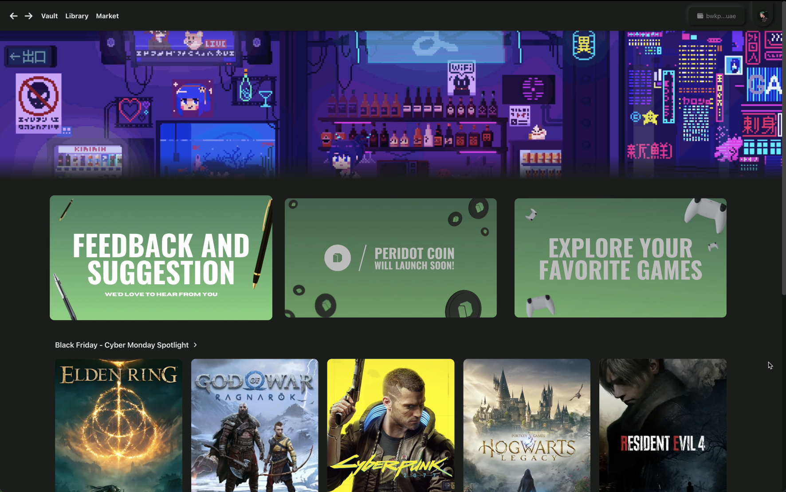
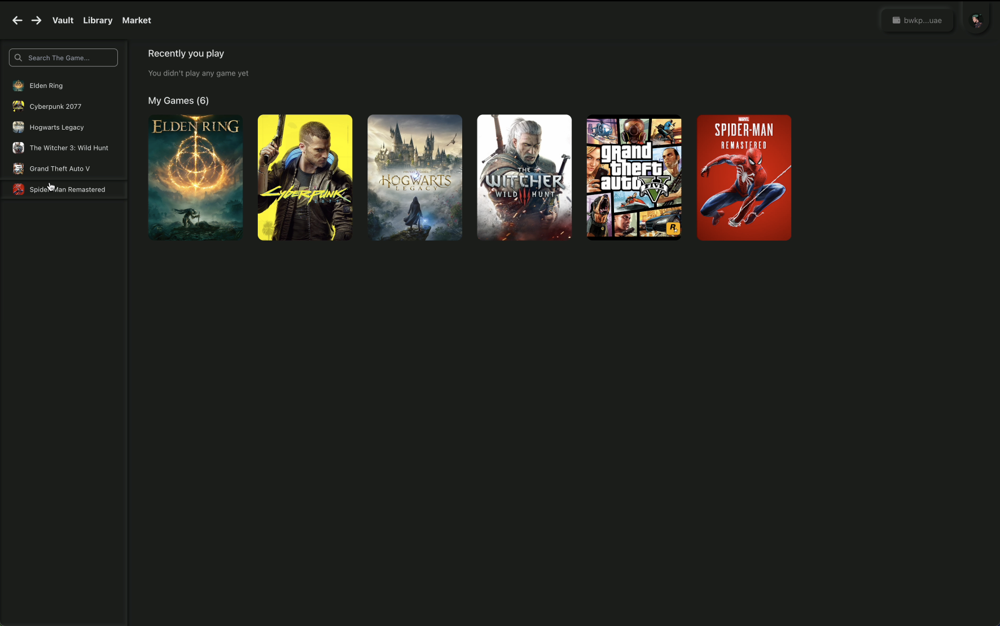
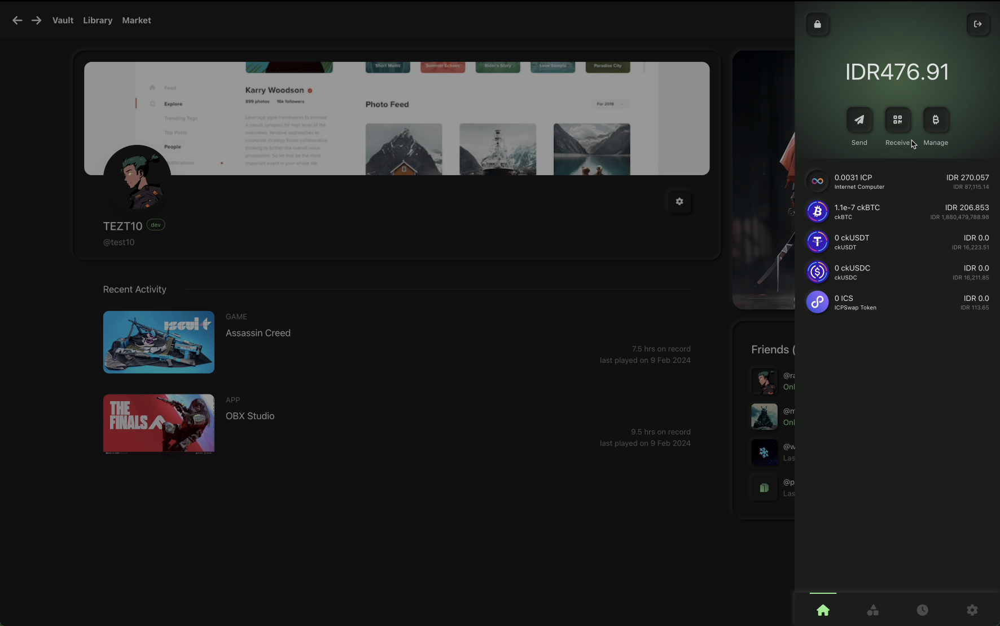
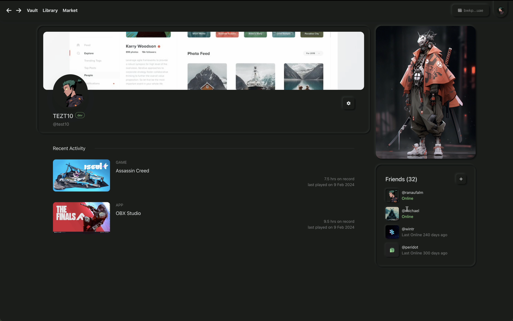

# `PeridotVault`

PeridotVault is an **AI-powered desktop gaming platform** designed to revolutionize how players and developers experience gaming. By integrating **artificial intelligence** and **decentralized technology**, PeridotVault creates a seamless environment where **Web2 and Web3 games coexist** without barriers.

For players, PeridotVault offers **personalized game recommendations**, **AI-driven interaction**, and **true ownership** of digital assets through **NFT technology** on the Internet Computer (ICP) blockchain. For developers, it removes traditional barriers by providing an **open SDK**, **low-cost game publishing ($10)**, and **zero-gas-fee transactions**, making it accessible to indie developers worldwide.

## 💁🏻 Hack Info

- Category: Gaming, Web3, AI, Blockchain
- Demo: [Live Demo](https://peridotvault.com)
- Introduction Video: [YouTube Link](https://www.youtube.com/watch?v=k-u_IqpcvDc&t=6s)

## 🌏 Ecosystem Overview

The Peridot Ecosystem consists of:

- [**PeridotVault On-Chain (This Repo)**](): Smart contracts for on-chain transactions, plus a landing page.
- [**PeridotVault Desktop (Main App)**](https://github.com/peridotvault/peridot-desktop): A desktop game launcher with AI-powered recommendations and Web3 integration.
- [**PeridotVault AI Engine**](https://github.com/peridotvault/peridot-recsys-onchain): A separate repo for machine learning models used in personalized recommendations.
- [**PeridotVault Design**](https://www.figma.com/design/k12e2mFMhzvKMsIff0nwTx/Peridot-Design?node-id=196-332&t=K8aeUZ713OXSkh1Z-1) : A separate repo for machine learning models used in personalized recommendations.

## ⚒️ Tech Stack

- Built on **Internet Computer Protocol (ICP)**
- **Native PER token** for ecosystem transactions
- Integrated **NFT** technology
- Advanced **AI** for personalization
- Backend Storage : Wasabi
- Programming Language : Typescript, Motoko, Python

## 💻 Our Core Platform Features

### 1.Game Vault



### 2.Library



### 3.Native Wallet



### 4.Profile



## ℹ️ Tech Information

Welcome to your new `peridot_onchain` project and to the Internet Computer development community. By default, creating a new project adds this README and some template files to your project directory. You can edit these template files to customize your project and to include your own code to speed up the development cycle.

To get started, you might want to explore the project directory structure and the default configuration file. Working with this project in your development environment will not affect any production deployment or identity tokens.

To learn more before you start working with `peridot_onchain`, see the following documentation available online:

- [Quick Start](https://internetcomputer.org/docs/current/developer-docs/setup/deploy-locally)
- [SDK Developer Tools](https://internetcomputer.org/docs/current/developer-docs/setup/install)
- [Motoko Programming Language Guide](https://internetcomputer.org/docs/current/motoko/main/motoko)
- [Motoko Language Quick Reference](https://internetcomputer.org/docs/current/motoko/main/language-manual)

If you want to start working on your project right away, you might want to try the following commands:

```bash
cd peridot_onchain/
dfx help
dfx canister --help
```

## 💨 Running the project locally

If you want to test your project locally, you can use the following commands:

```bash
# Starts the replica, running in the background
dfx start --background

# Deploys your canisters to the replica and generates your candid interface
dfx deploy
```

Once the job completes, your application will be available at `http://localhost:4943?canisterId={asset_canister_id}`.

If you have made changes to your backend canister, you can generate a new candid interface with

```bash
npm run generate
```

at any time. This is recommended before starting the frontend development server, and will be run automatically any time you run `dfx deploy`.

If you are making frontend changes, you can start a development server with

```bash
npm start
```

Which will start a server at `http://localhost:8080`, proxying API requests to the replica at port 4943.

### Note on frontend environment variables

If you are hosting frontend code somewhere without using DFX, you may need to make one of the following adjustments to ensure your project does not fetch the root key in production:

- set`DFX_NETWORK` to `ic` if you are using Webpack
- use your own preferred method to replace `process.env.DFX_NETWORK` in the autogenerated declarations
  - Setting `canisters -> {asset_canister_id} -> declarations -> env_override to a string` in `dfx.json` will replace `process.env.DFX_NETWORK` with the string in the autogenerated declarations
- Write your own `createActor` constructor

## 📇 Contact

CEO of PeridotVault - Ranaufal Muha - ifal.muha@gmail.com
